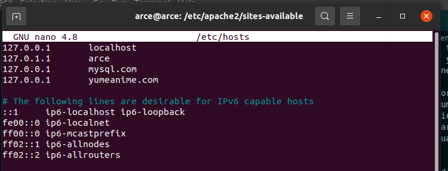

# yumeanime
Repositorio para el proyecto del TFG, aquí se guardará toda la información, avances y ficheros para la resolución del proyecto.

---

1. [Nombre del Proyecto](#nombre)
2. [Investigación y Comparación del Proyecto con similares](#compara)
3. [Explicación de las especificaciones del proyecto](#explica)
4. [Planning del Proyecto](#plan)
5. [Diseño del proyecto y sus páginas](#design)
6. [Esquemas y especificaciones de la base de datos](#baseDatos)
7. [Diagrama de Casos de Uso](#casosUso)
8. [Anotaciones y Aclaraciones](#memoria)

<a name="nombre"></a>

---

## Nombre del Proyecto

Yumeanime

#### Explicación del nombre escogido

El nombre procede de la unión de dos palabras:

- Yume (del japonés), que traducido al español significa "sueño".
- Anime (del japonés), que significa "animado".

<a name="compara"></a>

## Investigación y Comparación del Mercado

- somoskudasai:
    Puntos a favor:
        - Está constantemente en actualización
        - Tiene un gran equipo de desarrollo que cada día escribe entre 3 y 5 noticias nuevas
        - Gran variedad de información sobre anime, cultura japones, etc...

    Puntos en contra:
        - No tiene una indexación que te permita buscar fácilmente las noticias antiguas
        - En la página principal solo aparecen las noticias más recientes, por lo que las antiguas las pierdes.

- animeflv:
    Puntos a favor:
        - Gran cantidad de animes
        - Gran comunidad
        - Muchas formas de filtrar la búsqueda de animes
        - Guardado de animes favoritios, en espera y viendo
    
    Puntos en contra:
        - No puedes crear tus propias listas de anime
        - No puedes compartir una lista con varios animes
        - Faltan algunos animes por añadir

- jkanime:
    Puntos a favor:
        - Bonita interfaz y atractiva
        - Tiene todos los animes del mercado
    
    Puntos en contra:
        - Tarda un par de días en subir el capítulo
        - No tiene página de noticias
        - No puedes hacer lista personalizada de animes

<a name="explica"></a>

## Explicación del Proyecto

Voy a crear una página principalmente de noticias y contenido anime, donde puedas investigar los animes del mercado y puedas crear tu propia lista personalizada de los animes que quieras almacenar en la misma, ya sea por su categoría, o por la atracción que te han creado, o por si sería un anime que recomendarías, etc... (opcionalmente también de las noticias). La página tendrá tres tipos de usuarios: "Usuario normal", es decir, el que se registra en la página, al que se le permite crear sus propias listas, comentar, dar "me gusta"; "Usuario sin registrar", al que no se le permite realizar ninguna acción exceptuando la de navegar por la aplicación, leer las páginas dedicadas de cada anime, y visualizar las listas de otros usuarios; "Usuario administrador", al que se le permite realizar cualquier acción en la página, como añadir animes y noticias. Opcionalmente, también intentaré crear una "mini" red social donde los otakus puedan interactuar entre ellos y compartir sus listas personalizadas, noticias, y hablar de otras cosas (versión extendida). En el caso de que sea rentable y tenga tiempo, seguiré desarrollando la página para que permita la visualización de los animes (versión extendida extendida).
    
<a name="plan"></a>

## Planificación
Grant en el siguiente enlace: 
https://docs.google.com/spreadsheets/d/1-KXS5N--oKPiSEBPsgFjpQpuVVrh9BLd4Oyl7MlccDY/edit?usp=sharing

<a name="design"></a>

---

## Diseño
En este apartado se recogerán todas las características del diseño, es decir, tipografía, color, y el diseño de las páginas será publicado al github una vez finalizado.

#### Colores
Resalto -> #D4C859
Fondo -> #FAF8F7
Nav, cabecera y destacados -> #0A1940
Botones y contenedores -> #465987

#### Fuentes
Título ->{
    - Oleo Script Swash Caps : https://fonts.google.com/specimen/Oleo+Script+Swash+Caps?category=Display&preview.text=Yumeanime&preview.text_type=custom
    - Lilita One : https://fonts.google.com/specimen/Lilita+One?category=Display&preview.text=Yumeanime&preview.text_type=custom
}

Parrafadas -> Mulish : https://fonts.google.com/specimen/Mulish?category=Sans+Serif&preview.text=Lorem%20ipsum%20dolor%20sit%20amet,%20consectetur&preview.text_type=custom

#### Web Design
La maqueta se puede encontrar en el siguiente enlace: https://github.com/raulfarce01/yumeanime/tree/main/Maqueta

La guía de estilo se encuentra en este: https://github.com/raulfarce01/yumeanime/blob/main/Gu%C3%ADa%20de%20Estilo.pdf

<a name="baseDatos"></a>

---

## Base de Datos

El modelo entidad - relación se puede encontrar en este enlace: https://github.com/raulfarce01/yumeanime/blob/main/YumeanimeE-R.png

El grafo relacional se encuentra en este otro: https://github.com/raulfarce01/yumeanime/blob/main/Grafo%20Relacional%20Yumeanime.pdf
En el último se explica qué era lo que faltaba para normalizar y el proceso para hacerlo.

<a name="casosUso"></a>

---

## Casos de uso

En este esquema podemos ver los distintos usuarios que vamos a poder crear en la página y las funcionalidades de cada uno de ellos:
https://github.com/raulfarce01/yumeanime/blob/main/DiagramaCasosUso.png

<a name="memoria"></a>

---

## Anotaciones y Aclaraciones

#### Despliegue de la aplicación con Laravel y phpMyAdmin

Para desplegar la aplicación hemos tenido que crear el siguiente virtualHost en la ruta:

*/etc/apache2/sites-available*


La ruta del documento está puesta en public ya que ahí se encuentra la *welcome.blade.php* de laravel, la página donde tenemos la documentación y todo lo necesario de laravel. Una vez vayamos avanzando en el código crearemos una redirección al *index* del proyecto.

Y debemos escribir los siguientes comandos:

```
sudo a2ensite yumeanime.com.conf  
sudo systemctl restart apache2.service
```

También hemos tenido que añadir un Host en:

*/etc/hosts*



Al hacer esto solamente, si entramos en *yumeanime.com* nos saldrá una pantalla de error típica de Laravel de que no hay permisos para mostrar la página, por eso, debemos escribir las siguientes líneas de comando:

```
sudo chown -R www-data:www-data /var/www/yumeanime/web  
sudo chmod -R 755 /var/www/yumeanime/web
```

Estas líneas darán los permisos necesarios para que, a partir de ahora, podamos ver la página de larabel.

Fuente: [Cómo instalar Laravel en Ubuntu Linux con Apache](https://liukin.es/como-instalar-laravel-en-ubuntu-linux-con-apache/)

#### Implementación y Codificación

Se ha optado por no utilizar laravel por la falta de tiempo, ya que no es algo que se puede aprender a utilizar en dos semanas, se necesita dedicar MUCHO tiempo para aprender a usar laravel y ser capaz de cerrar las brechas que tiene, por ejemplo, las bases de datos al crearlas con Laravel, entre muchas otras brechas que tiene.